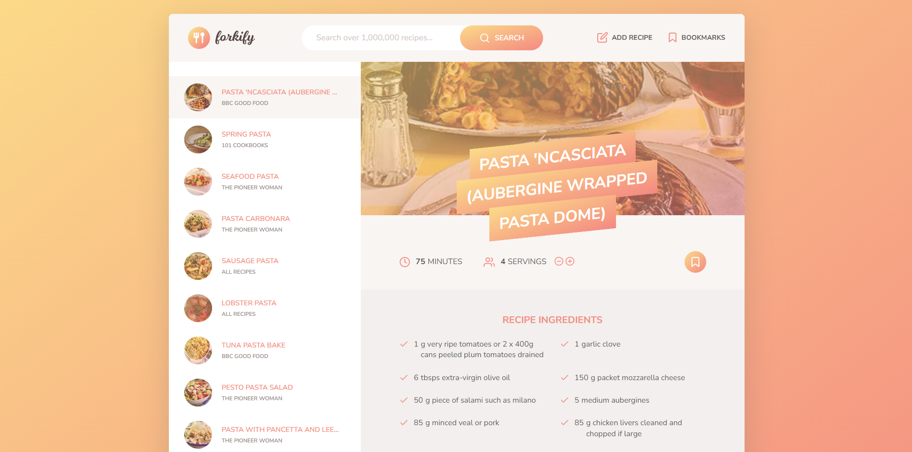

# Forkify Project

Forkify is a JavaScript application that interacts with and API to fetch and display food recipe(s).

## You can click [HERE](https://forkify-aynurdadashova.netlify.app/) to see a live demo and search for your favourite recipe

## Features

- User can search over 1,000,000 recipes.
- Powered by the [Forkify API](https://forkify-api.herokuapp.com/v2).
- Displays the ingredients required to prepare a dish.
- Allows user to choose serving size and accordingly adjusts ingredients.
- Displays recipe images.
- Directs user to source site for detailed recipe procedure.
- Ingredients can be added/removed to/from the shopping list.

## Built With

- HTML5
- CSS3
- SCSS
- JavaScript
- Parcel
- NPM



## Installation

- Clone the repo:

```sh
git clone https://github.com/aynurdadashova/Forkify.git
```

- Install dependencies:

```sh
npm install
```

- Run the app:

```sh
npm start
```
